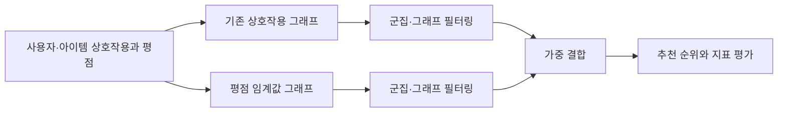

<a name="사용자-평점-기반-그래프-추천"></a>
<a name="사용자-평점-기반-그래프-필터링-추천"></a>
<a name="performance-improvement-of-recommendation-systems-using-user-evaluation-information"></a>

<a id="-rating-aware-recommendation-project"></a>

# Rating Aware Recommendation Project

사용자 평점을 반영한 그래프 필터로 추천 순위를 만드는 연구입니다.

<!-- reading-levels17:start -->
| 읽기 수준 | 안내 내용 |
| --- | --- |
| [LEVEL 1 - Beginner](docs/%EC%9D%BD%EA%B8%B0%EC%95%88%EB%82%B4/%EB%A0%88%EB%B2%A81.md) | 낯선 용어를 풀고 입력부터 결과까지 구체적인 예로 읽기 |
| [LEVEL 2 - Explorer](docs/%EC%9D%BD%EA%B8%B0%EC%95%88%EB%82%B4/%EB%A0%88%EB%B2%A82.md) | 핵심 개념과 처리 흐름의 관계 이해 |
| [LEVEL 3 - Practitioner](docs/%EC%9D%BD%EA%B8%B0%EC%95%88%EB%82%B4/%EB%A0%88%EB%B2%A83.md) | 실험·사용 절차와 결과 해석 따라가기 |
| [LEVEL 4 - Advanced](docs/%EC%9D%BD%EA%B8%B0%EC%95%88%EB%82%B4/%EB%A0%88%EB%B2%A84.md) | 코드 구조·설정·설계 선택과 제약 검토 |
| [LEVEL 5 - Expert](docs/%EC%9D%BD%EA%B8%B0%EC%95%88%EB%82%B4/%EB%A0%88%EB%B2%A85.md) | 논문·프로토콜·분모·누수·미검증 범위 대조 |

**논문 읽기:** 김희찬·곽윤석·김남기의 논문은 사물인터넷융복합논문지 12(5), 25 –33쪽, 2026.10에 게재되었습니다.

전체 9쪽 게재본은 [공식 KCI 페이지](https://www.kci.go.kr/kciportal/landing/article.kci?arti_id=ART003399306)에서 읽을 수 있습니다.

표지의 DOI는 10.20465/KIOTS.2026.12.5.025이며 온라인 읽기는 KCI로 안내합니다.

**HWP는 기존 투고 원고**입니다.

게재본 PDF는 저장소에 첨부하지 않습니다.

과거 차수의 파일 구성도·해시·쪽 수는 해당 투고 자료의 이력으로 읽어 주세요.
<!-- reading-levels17:end -->

분야: 추천 시스템 › 그래프 신호 처리 › 평점 반영 이중 그래프 필터

`논문·연구 자료` `Document`

[원고 읽기](#quick-start) · [저장소 구성](#structure) · [자료·설정](#data)

[핵심 구성](#input-processing-output)

<details>
<summary>원고 제목</summary>

Performance Improvement of Recommendation Systems using User Evaluation Information

</details>

<a id="-연구-핵심"></a>

## 연구 요약

상호작용 그래프와 평점 정보를 결합하여 추천 순위를 평가하는 원고입니다.

추천 그래프의 구성과 데이터셋별 비교 결과를 원고에 정리했습니다.

- 두 그래프를 결합하는 설계와 네 데이터셋의 평점·상호작용 구성을 설명합니다.
- K별 F1·NDCG·MRR을 비교하며, ML-1M에서는 MRR @10이 감소한 결과도 함께 보고합니다.

**자료별 안내:** [최종 원고](docs/versions/final-paper.md) · [전체 기록](docs/VERSIONS.md)

<a name="preview"></a>


[근거 파일 보기](https://www.kci.go.kr/kciportal/landing/article.kci?arti_id=ART003399306)

<a name="input-processing-output"></a>

<a id="-입력처리출력"></a>

## 입력·처리·출력

| 구분 | 내용 |
| --- | --- |
| 문제 | 평점 정보를 추가한 그래프가 추천 순위에 미치는 영향을 비교합니다. |
| 입력 | 사용자·아이템 상호작용과 평점 |
| 처리 | HiGSP 기반 두 그래프·필터 점수 결합 |
| 출력 | 추천 순위와 NDCG·MRR 지표 |

---

<a id="-논문과-최신-자료"></a>

## 논문과 최신 자료

| 자료 | 원문 파일 |
| --- | --- |
| 최종 논문 · 평점 기반 추천 | [공식 게재 페이지](https://www.kci.go.kr/kciportal/landing/article.kci?arti_id=ART003399306) |

[자료별 설명](docs/PAPERS.md) · [코드 차수와 변경 이력](docs/REVISION_INDEX.md)

<a id="️-차수별-프로젝트-안내"></a>

## 전체 차수

| 차수·단계 | 주요 내용 | 자료 | 직전 비교 |
| --- | --- | --- | --- |
| [1차 · 06.17/06.22/06.29 원고 묶음](docs/revisions/paper-1.md) | 06.17·06.22·06.29의 수정본과 영문 원고가 이어진 초기 편집 단계입니다. | [폴더](%EC%9B%90%EA%B3%A0%EB%8B%A8%EA%B3%84/1%EC%B0%A8) | [전체 비교](docs/revision-diffs/paper-1-%EC%97%B4%EB%9E%8C.md) |
| [2차 원고](docs/revisions/paper-2.md) | <a id="layout18-table-4-row-2-field-1"></a>평가 대상을 네 데이터셋으로 정리하고 평점 임계값·결합 비율과 지표의 예외를 명확히 한 원고 단계입니다. | [폴더](%EB%85%BC%EB%AC%B8) | [전체 비교](docs/revision-diffs/paper-2-%EC%97%B4%EB%9E%8C.md) |
| [3차 · 사물인터넷학회 양식 원고](docs/revisions/paper-3.md) | 국영문 초록·제목·양식을 정리한 편집 단계이며, 같은 연구의 여러 참고문헌 판을 구분해 읽습니다. | [폴더](%EB%85%BC%EB%AC%B8) | [전체 비교](docs/revision-diffs/paper-3-%EC%97%B4%EB%9E%8C.md) |
| [최종 원고](docs/revisions/final.md) | <a id="layout18-table-4-row-4-field-1"></a>사용자 평점 정보를 기존 상호 작용 그래프와 결합해 추천 순위의 성능을 비교한 당시 10 쪽 투고 원고를 설명하는 단계입니다.<br>현재 9쪽 게재본은 공식 KCI 페이지에서 확인합니다. | [폴더](%EB%85%BC%EB%AC%B8) | [전체 비교](docs/revision-diffs/final-%EC%97%B4%EB%9E%8C.md) |


<a id="-프로젝트-소개"></a>

## 연구 방법

저자: **김희찬 · 곽윤석 · 김남기**

한국 사물 인터넷 학회의 **사물 인터넷 융 복합 논문지** 양식으로 작성한 연구 원고입니다.

| 항목 | 원고에서 다루는 내용 |
| --- | --- |
| 두 그래프 구성 | 전체 상호작용 그래프와 평점 2 또는 5 이상 그래프를 구분합니다. |
| 그래프 필터링 | 사용자 군집과 이상·고차 저역통과 필터를 적용합니다. |
| 가중 결합 | 기존 HiGSP 경로와 평점 기반 경로의 예측을 결합합니다. |
| 추천 지표 비교 | 네 데이터셋의 F1·MRR·NDCG를 K =5·10에서 비교합니다. |


```mermaid
flowchart LR
A[사용자·아이템 상호작용과 평점] --> B[기존 상호작용 그래프]
A --> C[평점 임계값 그래프]
B --> D[군집·그래프 필터링]
C --> E[군집·그래프 필터링]
D --> F[가중 결합]
E --> F
F --> G[추천 순위와 지표 평가]
```

<a name="structure"></a>
<a id="-저장소-구성"></a>

## 저장소 구성

```text
.
├── README.md
├── CHANGELOG.md
└── 논문/
    └── 최종_논문.pdf
```

- [전체 최종 원고](https://www.kci.go.kr/kciportal/landing/article.kci?arti_id=ART003399306)

<a id="-평점-정보와-가중-결합"></a>

## 평점 정보와 가중 결합

ML-100K, ML-Latest-Small, ML-1M, CiaoDVD를 사용한 비교를 설명합니다. 평점 임계값은 추가 그래프에 남길 상호 작용을 고르는 기준입니다. 기존 그래프를 함께 사용하는 이유는 낮은 평점의 상호 작용까지 모두 버리면서 생길 수 있는 정보 손실을 줄이기 위해서입니다.

기본 결합 비율은 5:5이며 Ratings5의 ML-Latest-Small은 7:3, ML-1M은 8:2의 예외를 둡니다. 두 설정의 비교에는 평점 임계값과 그래프 결합 비율의 영향이 함께 반영됩니다.

실험 설정은 alpha1 0.3, alpha2 0.7, 필터 차수 8, 특이 성분 수 256, 군집 수 5, random_state 2024입니다. 당시의 환경과 패키지 버전은 원고의 환경 표에 정리했습니다.

<a name="quick-start"></a>
<a id="-원고-읽기"></a>

## 원고 읽기

1. 위의 최종 원고 링크를 엽니다.
2. 서론의 연구 질문과 방법을 먼저 읽습니다.
3. 결과표와 함께 한계·후속 연구를 확인합니다.

사용자 평점과 상호작용 그래프를 결합한 추천 방법과 데이터셋별 비교 결과를 담은 연구 논문을 수록했습니다.

<a name="data"></a>
<a id="-자료-구성과-결과-해석"></a>

## 자료 구성과 결과 해석

현재 게재본은 공식 KCI 페이지로 안내하고 기존 편집 원본은 투고 원고로 보존합니다. 1~3차의 수정 내용은 변경 설명과 비교 이력에 남겼습니다.

추천서비스의 실제 사용자 기록이나 데이터셋 원본은 업로드하지 않습니다. 현재 최종 원문은 저자명·공식 소속·이메일·저자소개 사진과 연구 본문·도표를 보존하며 이전 공개본은 Git 변경 이력에서 확인할 수 있습니다.

<a name="원고가-보고한-결과와-한계"></a>

<a id="-원고가-보고한-결과와-한계"></a>

### 원고가 보고한 결과와 한계

원고의 Ratings2는 24개 데이터셋·지표 조합 중 23개에서 향상을 보고하며, ML-1M MRR @10은 0.5603에서 0.5601로 감소합니다. Ratings5는 24개 모두 향상했다고 보고합니다.

CiaoDVD MRR @5는 0.0133 →0.0155로 증가했으며 상대 향상률은 16.54%입니다.

CiaoDVD에서는 K =5의 세 지표 모두 Ratings5가 Ratings2보다 높지만, K =10에서는 Ratings2가 더 높습니다. 적합한 임계값은 데이터셋과 평가 K에 따라 달라집니다.

| 데이터셋 | 사용자 | 아이템 | 상호작용 수 | 평점 범위 |
| --- | --- | --- | --- | --- |
| ML-100K | 943 | 1,682 | 100K | 1~5 |
| ML-Latest-Small | 610 | 9,724 | 100K | 0.5~5.0 |
| ML-1M | 6,040 | 3,706 | 1M | 1~5 |
| CiaoDVD | 17,615 | 16,121 | 72K | 1~5 |

위 규모는 원고 5 쪽 표의 표기입니다. 원고는 ML-100K·ML-1M의 학습·시험 자료를 새로 분할했다고 설명하지만, 공개 실행 코드나 분할 목록은 제공하지 않습니다.

F1은 추천 목록의 정밀도·재현율을 함께, MRR은 정답의 순위를, NDCG는 순위에 따른 관련 도를 비교하는 지표입니다. 결과는 모두 K =5·10으로 나누어 읽어 주세요.

실행시간·메모리 측정, 추가 그래프의 처리 비용과 통계적 유의성 검증은 후속 과제입니다. 그래프 가중치의 영향도 함께 평가할 필요가 있습니다.

<a id="-문제-해결"></a>

## 문제 해결

| 상황 | 확인할 내용 |
| --- | --- |
| 추천 결과를 바로 재현하고 싶습니다. | 논문 중심 자료입니다.<br>실행 가능한 코드·환경 파일의 포함을 보장하지 않습니다. |
| 모든 지표가 개선 되었나요? | Ratings2의 ML-1M MRR @10 감소를 포함하여 조건별 결과를 확인하세요. |
| 상대 개선율이 크게 보입니다. | 낮은 기준 점수에서는 상대율이 커질 수 있으므로 절대 점수 차이도 함께 보세요. |

현재 최종 원고는 [공식 게재 페이지](https://www.kci.go.kr/kciportal/landing/article.kci?arti_id=ART003399306)입니다. 이전 초안은 해당 차수의 자료로 구분합니다.

<a id="-현재-첨부-문서"></a>

## 최신 문서와 변경 이력

현재 제공하는 원문과 직전 공개본의 비교입니다. 이전 원고·발표와 코드는 전체 차수 표에서 확인할 수 있습니다.

| 문서 | 자료 폴더 | 상세 | 직전 공개본 전체 비교 |
| --- | --- | --- | --- |
| 최종 논문 · 평점 기반 추천 | [폴더](%EB%85%BC%EB%AC%B8) | [설명](docs/latest/rating-aware-graph-filter.md) | [전체 비교](docs/changes/2026-11-02-%EC%B5%9C%EC%8B%A0%EB%AC%B8%EC%84%9C-%EC%A0%84%EC%B2%B4%EB%B9%84%EA%B5%90.md) |

[최신 문서 구성 변경](docs/changes/2026-11-02-%EC%B5%9C%EC%8B%A0%EB%AC%B8%EC%84%9C.md)

<a name="research-details"></a>

<a id="-연구구현의-세부-흐름"></a>

## 차수별 방법과 조건

차수별 입력, 처리 방법, 실행 조건과 결과를 정리했습니다.

<a id="-1차--평점-기반-추천-원고의-수정-흐름"></a>

<details>
<summary>1차·평점 기반 추천 원고의 수정 흐름</summary>

### 1차·평점 기반 추천 원고의 수정 흐름

06.17·06.22·06.29의 수정본과 영문 원고가 이어진 초기 편집 단계입니다.

| 구성 | 처리 내용 |
| --- | --- |
| <a id="layout18-table-9-row-1"></a> 초기 주장 비교 | 영문 초록의 five benchmark datasets와 본문의 네 데이터셋 표 등 당시 불일치를 구분합니다. |
| <a id="layout18-table-9-row-2"></a> 편집의 변화 | 한글·영문 표현과 그래프 필터 설명이 단계마다 달라지는 흐름을 비교합니다. |
| <a id="layout18-table-9-row-3"></a> 평점 그래프 | 임계값 2·5 이상인 평가 정보를 이용해 Ratings2·Ratings5를 구성합니다. |
| <a id="layout18-table-9-row-4"></a> 이중 경로 | 기존 전체 상호작용 경로와 평점 정보를 이용한 경로를 결합합니다. |
| <a id="layout18-table-9-row-5"></a> 평가 지표 | F1·MRR·NDCG를 K5·10과 데이터셋별로 나누어 읽습니다. |
| <a id="layout18-table-9-row-6"></a> 기본 결합 | 기본 5:5 비율과 Ratings5의 데이터셋별 예외를 표와 함께 확인합니다. |


| 입력·실행 조건 | 내용 |
| --- | --- |
| 데이터셋 | ML-100K·ML-Latest-Small·ML-1M·CiaoDVD |
| 평점 임계값 | 2 또는 5 |
| 평가 | F1·MRR·NDCG, K5·10 |
| 기본 가중치 | HiGSP:제안 경로 5:5·일부 Ratings5 예외 |

최종 원고는 Ratings2의 24개 조합 중 23개, Ratings5의 24개 조합 전체에서 HiGSP 대비 개선을 보고합니다. 데이터셋·지표·평점 임계값별 원고 보고 결과로 읽습니다.

기본 결합 비율·평점 임계값·데이터셋·지표에 따라 효과가 다릅니다. 전체 사용자에게 추천 품질이 동일하게 좋아진다거나 운영 서비스의 결과로 확대하지 않습니다.

| 제약 | 확인할 내용 |
| --- | --- |
| 자료 범위 | 원고와 도표이며 추천 서비스·실험 코드·원본 사용자 로그는 별도 자료입니다. |
| 개선의 예외 | Ratings2의 ML-1M MRR @10은 감소합니다.<br>모든 지표가 개선됐다고 일반화하지 않습니다. |
| 서지 | 권·호·날짜 자리표시자와 공식 게재 확인은 구분합니다. |

[파일 구성·핵심 정의·사용 순서](docs/revisions/paper-1.md) · [이 단계 전체 비교](docs/revision-diffs/paper-1-%EC%97%B4%EB%9E%8C.md)

<a id="-2차--평점-임계값과-지표-해석-구체화"></a>

</details>

<details>
<summary>2차·평점 임계값과 지표 해석 구체화</summary>

### 2차·평점 임계 값과 지표 해석 구체화

평가 대상을 네 데이터셋으로 정리하고 평점 임계값·결합 비율과 지표의 예외를 명확히 한 원고 단계입니다.

| 구성 | 처리 내용 |
| --- | --- |
| 조건의 명시 | Ratings2·Ratings5의 임계값 2·5와 기본 5:5 결합 비율을 구체화합니다. |
| 예외의 명시 | ML-1M의 MRR @10 감소 예외와 High-order 필터 설명을 정리합니다. |
| 평점 그래프 | 임계값 2·5 이상인 평가 정보를 이용해 Ratings2·Ratings5를 구성합니다. |
| 이중 경로 | 기존 전체 상호작용 경로와 평점 정보를 이용한 경로를 결합합니다. |
| 평가 지표 | F1·MRR·NDCG를 K5·10과 데이터셋별로 나누어 읽습니다. |
| 기본 결합 | 기본 5:5 비율과 Ratings5의 데이터셋별 예외를 표와 함께 확인합니다. |

| 입력·실행 조건 | 내용 |
| --- | --- |
| 데이터셋 | ML-100K·ML-Latest-Small·ML-1M·CiaoDVD |
| 평점 임계값 | 2 또는 5 |
| 평가 | F1·MRR·NDCG, K5·10 |
| 기본 가중치 | HiGSP:제안 경로 5:5·일부 Ratings5 예외 |

최종 원고는 Ratings2의 24개 조합 중 23개, Ratings5의 24개 조합 전체에서 HiGSP 대비 개선을 보고합니다. 데이터셋·지표·평점 임계값별 원고 보고 결과로 읽습니다.

기본 결합 비율·평점 임계값·데이터셋·지표에 따라 효과가 다릅니다. 전체 사용자에게 추천 품질이 동일하게 좋아진다거나 운영 서비스의 결과로 확대하지 않습니다.

| 제약 | 확인할 내용 |
| --- | --- |
| 자료 범위 | 원고와 도표이며 추천 서비스·실험 코드·원본 사용자 로그는 별도 자료입니다. |
| 개선의 예외 | Ratings2의 ML-1M MRR @10은 감소합니다.<br>모든 지표가 개선됐다고 일반화하지 않습니다. |
| 서지 | 권·호·날짜 자리표시자와 공식 게재 확인은 구분합니다. |

[파일 구성·핵심 정의·사용 순서](docs/revisions/paper-2.md) · [이 단계 전체 비교](docs/revision-diffs/paper-2-%EC%97%B4%EB%9E%8C.md)

<a id="-3차--사물인터넷학회-양식과-참고문헌-편집"></a>

</details>

<details>
<summary>3차·사물 인터넷 학회 양식과 참고 문헌 편집</summary>

### 3차·사물 인터넷 학회 양식과 참고 문헌 편집

국영문 초록·제목·양식을 정리한 편집 단계이며, 같은 연구의 여러 참고문헌 판을 구분해 읽습니다.

| 구성 | 처리 내용 |
| --- | --- |
| <a id="layout18-table-15-row-1"></a> 양식 정리 | 한국사물인터넷학회 양식의 제목·국영문 초록과 원고 구성을 확인합니다. |
| <a id="layout18-table-15-row-2"></a> 판 구분 | 12.hwp는 최종 원고와 참고 문헌 편집이 다른 판입니다.<br>이름이 비슷한 PDF와 같은 원고라고 끌어 맞추지 않습니다. |
| <a id="layout18-table-15-row-3"></a> 평점 그래프 | 임계값 2·5 이상인 평가 정보를 이용해 Ratings2·Ratings5를 구성합니다. |
| <a id="layout18-table-15-row-4"></a> 이중 경로 | 기존 전체 상호작용 경로와 평점 정보를 이용한 경로를 결합합니다. |
| <a id="layout18-table-15-row-5"></a> 평가 지표 | F1·MRR·NDCG를 K5·10과 데이터셋별로 나누어 읽습니다. |
| <a id="layout18-table-15-row-6"></a> 기본 결합 | 기본 5:5 비율과 Ratings5의 데이터셋별 예외를 표와 함께 확인합니다. |


| 입력·실행 조건 | 내용 |
| --- | --- |
| 데이터셋 | ML-100K·ML-Latest-Small·ML-1M·CiaoDVD |
| 평점 임계값 | 2 또는 5 |
| 평가 | F1·MRR·NDCG, K5·10 |
| 기본 가중치 | HiGSP:제안 경로 5:5·일부 Ratings5 예외 |

최종 원고는 Ratings2의 24개 조합 중 23개, Ratings5의 24개 조합 전체에서 HiGSP 대비 개선을 보고합니다. 데이터셋·지표·평점 임계값별 원고 보고 결과로 읽습니다.

기본 결합 비율·평점 임계값·데이터셋·지표에 따라 효과가 다릅니다. 전체 사용자에게 추천 품질이 동일하게 좋아진다거나 운영 서비스의 결과로 확대하지 않습니다.

| 제약 | 확인할 내용 |
| --- | --- |
| 자료 범위 | 원고와 도표이며 추천 서비스·실험 코드·원본 사용자 로그는 별도 자료입니다. |
| 개선의 예외 | Ratings2의 ML-1M MRR @10은 감소합니다.<br>모든 지표가 개선됐다고 일반화하지 않습니다. |
| 서지 | 권·호·날짜 자리표시자와 공식 게재 확인은 구분합니다. |

[파일 구성·핵심 정의·사용 순서](docs/revisions/paper-3.md) · [이 단계 전체 비교](docs/revision-diffs/paper-3-%EC%97%B4%EB%9E%8C.md)

<a id="-최종-원고--사용자-평점을-활용한-추천-성능-비교"></a>

</details>

<details>
<summary>최종 원고 · 사용자 평점을 활용한 추천 성능 비교</summary>

### 최종 원고 · 사용자 평점을 활용한 추천 성능 비교

사용자 평점 정보를 기존 상호 작용 그래프와 결합해 추천 순위의 성능을 비교한 당시 10 쪽 투고 원고를 설명하는 단계입니다. 현재 9쪽 게재본은 공식 KCI 페이지에서 확인합니다.

| 구성 | 처리 내용 |
| --- | --- |
| <a id="layout18-table-18-row-1"></a> 최종 전체 본문 | 현재 게재본은 공식 페이지로 안내하고 사진을 포함한 기존 HWP는 투고 원고로 보존합니다. |
| <a id="layout18-table-18-row-2"></a> 보고 결과 | 네 데이터셋 × 두 K× 세 지표 24 조합에서 Ratings2는 23개, Ratings5는 24개 개선을 보고합니다. |
| <a id="layout18-table-18-row-3"></a> 평점 그래프 | 임계값 2·5 이상인 평가 정보를 이용해 Ratings2·Ratings5를 구성합니다. |
| <a id="layout18-table-18-row-4"></a> 이중 경로 | 기존 전체 상호작용 경로와 평점 정보를 이용한 경로를 결합합니다. |
| <a id="layout18-table-18-row-5"></a> 평가 지표 | F1·MRR·NDCG를 K5·10과 데이터셋별로 나누어 읽습니다. |
| <a id="layout18-table-18-row-6"></a> 기본 결합 | 기본 5:5 비율과 Ratings5의 데이터셋별 예외를 표와 함께 확인합니다. |


| 입력·실행 조건 | 내용 |
| --- | --- |
| 데이터셋 | ML-100K·ML-Latest-Small·ML-1M·CiaoDVD |
| 평점 임계값 | 2 또는 5 |
| 평가 | F1·MRR·NDCG, K5·10 |
| 기본 가중치 | HiGSP:제안 경로 5:5·일부 Ratings5 예외 |

최종 원고는 Ratings2의 24개 조합 중 23개, Ratings5의 24개 조합 전체에서 HiGSP 대비 개선을 보고합니다. 데이터셋·지표·평점 임계값별 원고 보고 결과로 읽습니다.

기본 결합 비율·평점 임계값·데이터셋·지표에 따라 효과가 다릅니다. 전체 사용자에게 추천 품질이 동일하게 좋아진다거나 운영 서비스의 결과로 확대하지 않습니다.

| 제약 | 확인할 내용 |
| --- | --- |
| 자료 범위 | 원고와 도표이며 추천 서비스·실험 코드·원본 사용자 로그는 별도 자료입니다. |
| 개선의 예외 | Ratings2의 ML-1M MRR @10은 감소합니다.<br>모든 지표가 개선됐다고 일반화하지 않습니다. |
| 서지 | 권·호·날짜 자리표시자와 공식 게재 확인은 구분합니다. |

[파일 구성·핵심 정의·사용 순서](docs/revisions/final.md) · [이 단계 전체 비교](docs/revision-diffs/final-%EC%97%B4%EB%9E%8C.md)

[차수별 안내 변경](docs/changes/2026-11-03-%EC%B0%A8%EC%88%98%EB%B3%84%ED%94%84%EB%A1%9C%EC%A0%9D%ED%8A%B8%EC%95%88%EB%82%B4.md)

</details>
